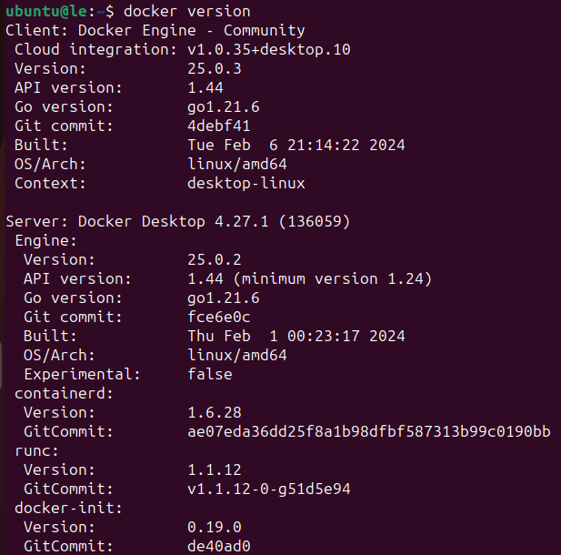
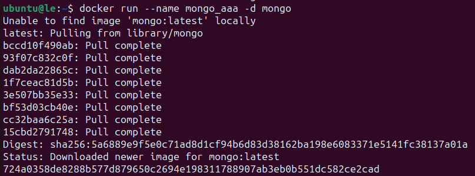
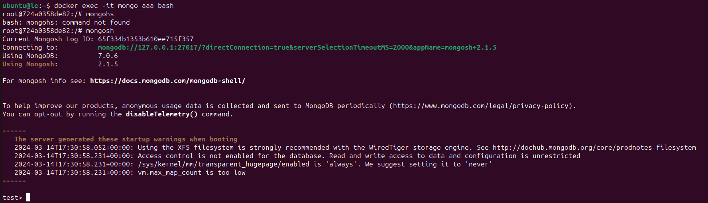
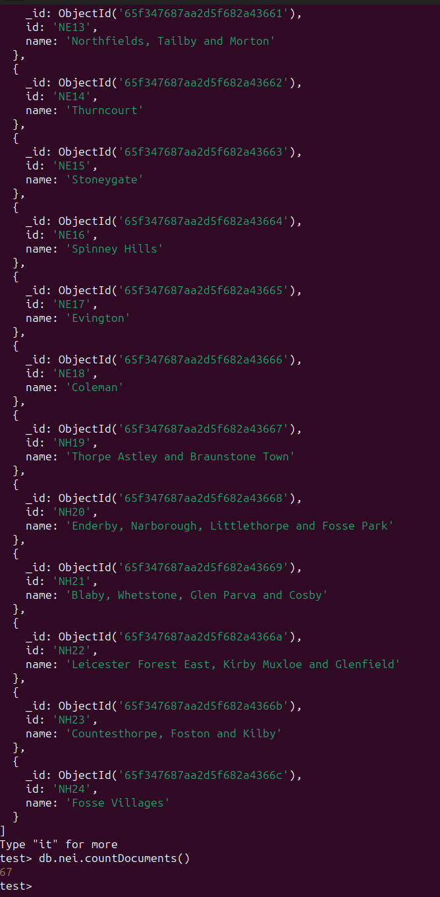
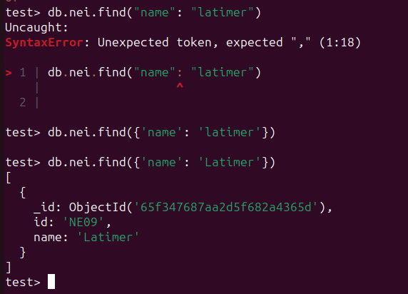
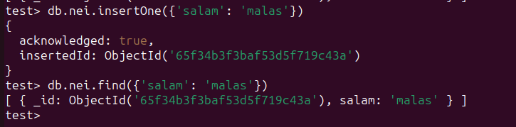

# MongoDB

1. Docker

2. Image

3. Mongosh

4. Add database from [it](https://github.com/jdorfman/awesome-json-datasets?tab=readme-ov-file#crime), Neighbourhoods

5. read

6. write

7. я сам не спарсил большой датасет, не успел :[ но коллеги утверждают,
что c индексом встроенный профайлер mongoDB дает 20% ускорения. 