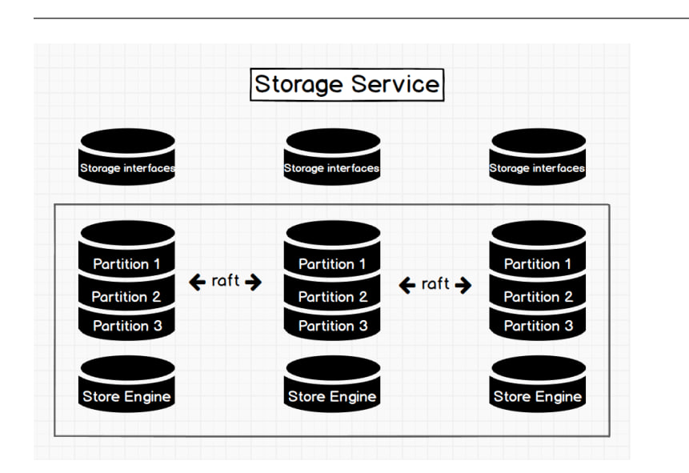

# Отчет о Nebula Graph

## а.) История развития
Небула граф была разработана в 2018 году компанией Vesoft Inc. В мае 2019, Небула Граф стала опен соурсным проектом на гитхабе и альфа версия была представлена в том же году.

В Июне 2020 года получила 8 миллионов долларов на китайских сборах. Третья версия была представлена в 2022 году.

На данный момент актуальная 3.6.0.

## б.) Инструменты для взаимодействия

Разработчики предоставляют свои механизмы для взаимадействия с БД.

[NebulaGraph Console](https://docs.nebula-graph.io/3.6.0/nebula-console/) : the native CLI client

[NebulaGraph CPP](https://docs.nebula-graph.io/3.6.0/14.client/3.nebula-cpp-client/): the NebulaGraph client for C++

[NebulaGraph Java](https://docs.nebula-graph.io/3.6.0/14.client/4.nebula-java-client/): the NebulaGraph client for Java

[NebulaGraph Python](https://docs.nebula-graph.io/3.6.0/14.client/5.nebula-python-client/): the NebulaGraph client for Python

[NebulaGraph Go](https://docs.nebula-graph.io/3.6.0/14.client/6.nebula-go-client/): the NebulaGraph client for Golang

Так же есть красивый [GUI](https://docs.nebula-graph.io/3.6.0/nebula-studio/about-studio/st-ug-what-is-graph-studio/)

## в.) Database Engine

Небула использует собственную разработку базы данных, которая была специально создана для обеспечения высокой производительности.

## г.) Язык запросов

У Небулы есть собственный язык запросов - nGQL. 

Вот их примеры, для упрощения приведены аналогии с SQL:

    nebula> GO FROM 100 OVER serve YIELD serve._dst AS Team | GO FROM $-.Team OVER serve REVERSELY YIELD $$.player.name;

## д.) Распределение данных по разным носителям

Да, данная БД предполагает множество мест хранения, внутри они представляются как разные сервера.

Информация на носителях распределяется. Возможен механизм дубликации, это явно прописывается в запросах.

## е.) Язык программирования

Написана она на C++. Для тестов используется Gherkin.

## ё.) Индексы

В БД есть возможность использовать индексы, причем разных видов.

### Native indexes
Есть два типа: индекс-ребро, индекс-тег. Позволяет быстрее обращаться к ребру или к тегу.
Пример: изменить значения на ребре будет быстрее.

### Full-text indexes
Для текста, вайлдкардов, регулярок.
Пример: быстрее будет доставать вершину с именем.

    nebula> CREATE TAG INDEX IF NOT EXISTS player_index_0 on player(name(10));

## ж.) Процесс выполнения запросов

Значала запрос обратывается парсером, затем проверяется на ошибки валидатором, оптимизируется планнером и запускается.

## з.) Планы запросов

Есть некоторые методы, которые показывают план запросов.

Без исполнения

С исполнением

## и.) Транзакции

Транзакий нет, да и зачем они тут :)

## й.) Восстановление данных

Существует отдельный пакет, называется [BR](https://docs.nebula-graph.io/3.1.0/backup-and-restore/nebula-br/1.what-is-br/), с его поомощи можно хранить и восстанавливать бекапы.

## к.) Шардинг

### Range based sharding
Сегментирование на основе диапазона, также известное как динамическое сегментирование, разбивает базы данных в соответствии с диапазоном с похожими значениями. Затем команда базы данных назначит сегментный ключ для каждого диапазона. Например, представьте, что вы разделяете базу данных продуктов по диапазонам размеров или базу данных клиентов по диапазонам в зависимости от их возраста. Каждый диапазон образует сегмент, который затем сохраняется на отдельном сервере базы данных.

### Directory based sharding

Осколки организованы в древовидную структуру. Корень дерева называется «каталогом», и каждая ветвь дерева соответствует сегменту. Когда клиент запрашивает данные из базы данных, каталог определяет, какую ветвь дерева следует запросить, чтобы найти соответствующие фрагменты. Таблица поиска используется для связи данных базы данных с соответствующим сегментом.

Шардинг на основе каталогов обычно используется, когда задействовано большое количество сегментов. Одним из недостатков сегментирования на основе каталогов является то, что его может быть сложнее настроить и управлять, чем другие типы сегментирования.

### Hashed sharding

Использует хеши для разделения данных на сегменты. Каждому шарду присваивается уникальное значение хеш-функции. Затем данные делятся на фрагменты на основе этих хеш-значений. Хэш-значение используется для определения того, какой осколок какое значение будет содержать. Это позволяет равномерно распределять данные.

### Geo sharding

Гео-шардинг разбивает и хранит информацию в соответствии с географическим местоположением. Например, платформа социальной сети может использовать разные сегменты для сохранения пользователей в зависимости от страны, города и т. д. Таким образом, когда пользователь находится, скажем, в Лос-Анджелесе, его запросы будут перенаправляться на сервер, на котором хранится сегмент для Лос-Анджелеса. . Это может повысить производительность, поскольку уменьшает задержку в сети между клиентом и сервером.

## л.) Data Mining, Data Warehousing и OLAP

Небула не является оптимальным выбором для этих целей из-за его ограничений по назначению и архитектуре. Небула лучше всего подходит для задач, требующих быстрые, масштабируемые и эффективные операции с данными, например для разработки соц. сети.

## м.) Методы защиты данных

В Небуле, как и например в Постгрес, есть аутентификация. Однако помимо просто создания пользователей БД также предоставляет возможнось создания групп с отдельными привилегиями. В БД даже есть отдельный кластер, meta, который спровляется с этими задачами (и с другими).

Есть возможность шифрования.

## н.) Сообщество

У проекта есть свой [Ютуб канал](https://www.youtube.com/@NebulaGraph/videos)!
На нем по мимо гайдов и презентаций есть даже обучалка для самых маленьких в GUI под музыку и [женщиной которая плохо читает текст на англиском](https://www.youtube.com/watch?v=wqpLofw_dDE&t=86s&ab_channel=NebulaGraphDB)! промотайте обязательно

Насколько я понимаю, сообщество не особо большое, возможно в Китае оно больше, на форуме во внешнем интернете активность небольшая.

Проект опенсорсный, его допалняют много людей.
https://github.com/vesoft-inc/nebula/graphs/contributors

Больше всего по видимому коммитов сделали сотрудники компании.

## о.) Примеры запросов с данными
Были выше

## п.) Демо

Помимо видео на ютубе есть сайт с кратким обзором, таких страничек много на разные версии
https://docs.nebula-graph.io/3.6.0/

## р.) Документация

https://docs.nebula-graph.io/3.6.0/pdf/NebulaGraph-EN.pdf

Вот ссылка на полную официальную документацию по последнему релизу, новые версии вероятно можно будет также найти на сайте.

## с.) Как знать о происходящем

Нужно следить за репозиторием
https://github.com/vesoft-inc/nebula

